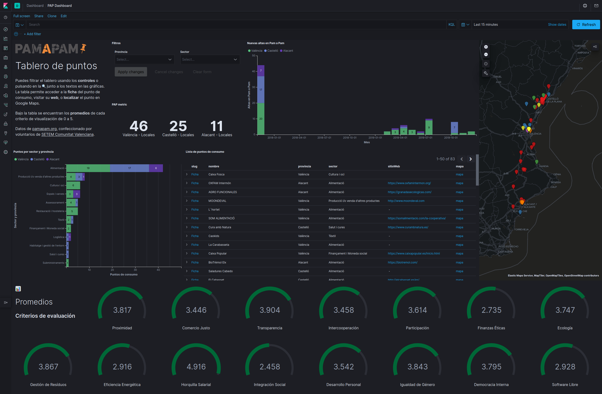

# Pam a Pam reporting

Small downloader for the data published at the [Pam a Pam](https://pamapampv.org/) website.

## Set up

This is a nodejs project, just use your favorite package manager to install and run the script to generate the output. 

```
$ yarn install
```


## Generate a CSV

A `.cache` folder will be created to store the intermediate assets and you can use the flag `-f` to ensure they are refreshed. You can override the caching folder and the output CSV file location.

```
$ yarn csv --help

Options:
  --help           Show help                                           [boolean]
  --version        Show version number                                 [boolean]
  -f, --force      Force to download the assets       [boolean] [default: false]
  -o, --output     Output CSV location                  [default: "pamapam.csv"]
  -c, --cache-dir  Directory for cached assets               [default: ".cache"]
```

**Note**: If you set up the environment variable `DEBUG=pamapam` you will get further details on the process being executed.

## Push to Elasticsearch

There's is another script that performs a similar process but instead of generating a CSV it pushes the data to an Elasticsearch cluster. The authorization to connect to the cluster is configured with a file that follows the syntax described on [this documentation page](https://www.elastic.co/guide/en/elasticsearch/client/javascript-api/current/client-configuration.html).

```
yarn elastic --help

Options:
  --help                Show help                                      [boolean]
  --version             Show version number                            [boolean]
  -f, --force           Force to download the assets  [boolean] [default: false]
  -c, --cache-dir       Directory for cached assets          [default: ".cache"]
  -e, --elastic-config  Elasticsearch configuration JSON file
                                                [default: ".elasticsearch.json"]
  -i, --index-name      Elasticsearch Index Name            [default: "pamapam"]
```

The most simple configuration file would be:

```json
{ 
  "node": "http://localhost:9200" ,
  "auth": {
    "username": "elastic",
    "password": "changeme"
  }
}

```

### Kibana Dashboard

The data pushed to Elasticsearch can be viewed using a Kibana Dashboard. Just import the dashboard saved objects file at the `resources` folder.




## TO DO

Finalize the exporting process:

- [ ] Expose a simple web interface to generate and download the CSV or update the Elastic cluster.
- [ ] Try to deploy the script to a PaaS like `now` or `heroku`
